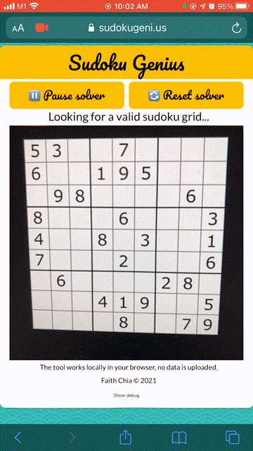

# Sudoku Genius

[](https://app.travis-ci.com/faithcsc/sudoku-genius)

Automatically solves sudoku puzzles using your phone's browser and camera.

Try it out: [sudokugeni.us](https://sudokugeni.us)

Made with [OpenCV.js](https://docs.opencv.org/master/d5/d10/tutorial_js_root.html) and [TensorFlow.js](https://www.tensorflow.org/js). All computation is done locally in the browser, no data is uploaded.

For best results: puzzle should be straight on (not at an angle), has even lighting, clear borders.



## Usage

NOTE: Does not work with Chrome/Firefox on iOS. iOS users, use Safari instead.

- Accept camera permissions.
- Point your camera directly at the puzzle.
- For best results, make sure the puzzle is
  - Straight on (not at an angle)
  - Has even lighting / not many shadows
  - Clear borders
- Once the solution is found, the solver will automatically stop.
- The original puzzle digits are black and the solution digits are red.
- If the solution cannot be found, resetting the solver usually helps.

## How it works

- OpenCV.js detects the sudoku grid.

- OpenCV.js and TensorFlow.js does image processing -- preprocesses the grid and individual cells so that it can be fed into the neural network.

- A TensorFlow.js neural network takes in each cell image and classifies it as 1-9 or 0/10 for an empty cell.

- Checks are done to see if the detected grid is a valid puzzle.

- If it is a valid puzzle, the brute force solver will solve the puzzle.

## Made with

- [NodeJS](https://nodejs.org/en/download/)
- [Tensorflow.js](https://www.tensorflow.org/js/tutorials/setup#nodejs_setup)
- [Opencv.js](https://docs.opencv.org/3.4/d5/d10/tutorial_js_root.html)
- [Enscripten - custom compiling of Opencv.js](https://docs.opencv.org/4.5.2/d4/da1/tutorial_js_setup.html)

## Deployed with

- [DigitalOcean](https://www.digitalocean.com/products/droplets/) basic droplet
- [Namecheap](https://www.namecheap.com/)
- [Nginx](https://www.nginx.com/)
- [Certbot](https://certbot.eff.org/)
- [Travis CI](https://travis-ci.org/)
- [Webpack](https://www.npmjs.com/package/webpack)

## Getting started

### Prequisites

- [npm](https://www.npmjs.com/)
- [NodeJS](https://nodejs.org/en/download/)
- [Python](https://www.python.org/downloads/)
- Working webcam or [OBS](https://obsproject.com/)

### Development

- Set up OBS to run with a video file of the sudoku puzzle.

  - [Using OBS as a Virtual Webcam](https://streamshark.io/blog/using-obs-as-a-virtual-webcam-on-windows-and-macos/)
  - Sample video files of sudoku puzzles are located in `examples/`

- Install dependencies and build project:

  ```
  npm install
  npm run build
  ```

- Start HTTP server

  ```
  cd dist
  python3 -m http.server
  ```

- Open `http://localhost:8000` in your browser and configure it to use the OBS virtual camera.

## Issues

If there are any problems, please first try with another OS or browser.

If the problem persists, open an issue with the following information:

- Debug info (Click on "Show debug" at the bottom of the page, copy/paste the contents)

If not possible to include debug info, please add:

- Browser
- OS
- A description of the error
- Steps to reproduce the error

## Acknowledgements

- Site design is adapted from Wes Bos's JS30 course [Day 23 - Speech Synthesis](https://github.com/wesbos/JavaScript30/tree/master/23%20-%20Speech%20Synthesis).
